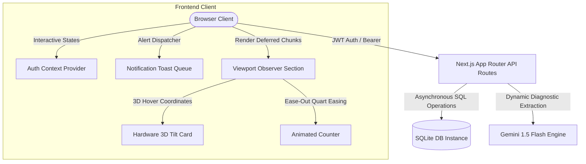
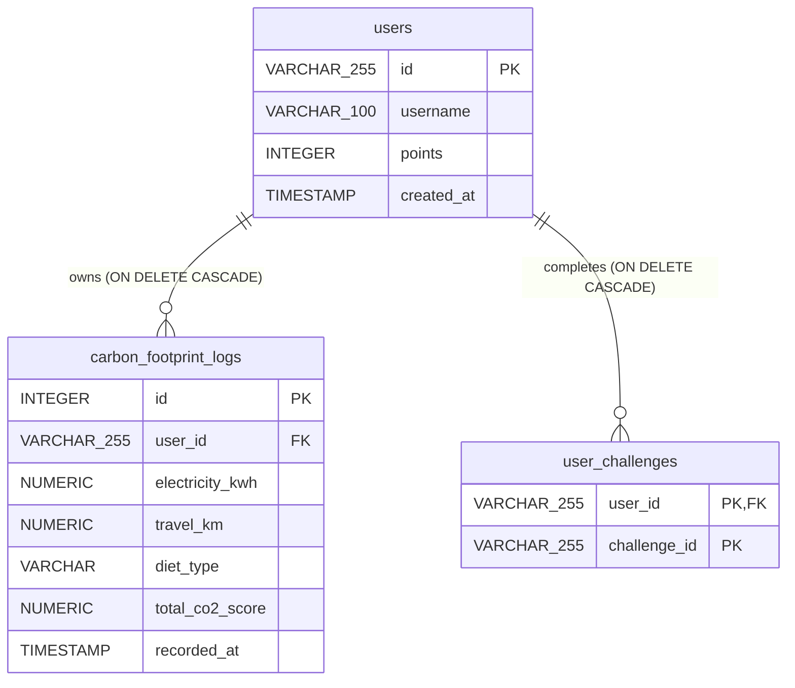

# EcoTrack AI: Carbon Footprint Awareness & Reduction Platform

> **Hack2Skill Challenge 3: Carbon Footprint Awareness Platform**
> A production-ready, highly optimized full-stack web application designed to compute, analyze, and gamify carbon footprint reduction. Featuring interactive 3D spatial cards, real-time predictive simulators, secure JWT-tenant isolation, and automated Gemini AI diagnostics.

---

## 1. Problem Statement & Project Objective

### 1.1 The Challenge
In the face of global climate change, raising awareness about individual carbon footprints and encouraging sustainable lifestyle shifts is critical. However, standard carbon calculators suffer from several key limitations:
- **Static & Non-Interactive**: Most tools are simple forms that calculate a score once without showing how specific behavioral shifts (e.g., reducing commute mileage or shifting diet) impact long-term trends.
- **Lack of Personalization**: Standard calculators do not provide tailored feedback or actionable recommendations, leaving users with numbers but no clear next steps.
- **No Gamification or Social Proof**: Users lack motivation to return because there is no system to track progress, earn rewards, or compare improvements within a community.

### 1.2 Our Solution: EcoTrack AI
EcoTrack AI is a modern, full-stack platform that addresses these issues through:
1. **Interactive "What-If" Simulation**: Real-time client-side sliders and projected Chart.js overlays show users the immediate, long-term impact of potential changes.
2. **Secure multi-tenant architecture**: Ensures users have fully isolated accounts (accessed via secure email-based JWT auth) that persist calculations and completed challenges.
3. **AI-Powered Diagnostics**: Queries the Gemini API to analyze footprint logs and generate personalized weekly sustainability challenges.
4. **Gamified Progress Tracking**: Integrates a live, SQL-backed community leaderboard and dynamic eco-badge achievements to incentivize sustainable behavior.

---

## 2. Architectural Overview & Technical Stack



### 2.1 Reactive Frontend State Layer
The client application is built using **Next.js**, **React 19**, and **Tailwind CSS 4**:
- **`AuthContext`**: Manages secure, asynchronous session token parsing. Upon mount, it clears stale sessions to ensure a fresh login gateway. Once logged in, it stores access tokens in cookies and scopes all local data under the active user prefix.
- **`NotificationContext`**: A priority-based Toast alert state queue. Dispatches success notifications (emerald green), input validations (amber warnings), or runtime exceptions (crimson alerts) into the DOM with slide-in and fade-out animations.
- **Dynamic 3D Layout & Viewports**: Intercepts mouse coordinates to calculate 3D tilt translations (`rotateX`, `rotateY`, `scale3d`) via the `TiltCard` component, and utilizes `IntersectionObserver` blocks (`ViewportSection`) to lazy load heavy components (like Chart.js) only when they enter the viewport.

### 2.2 Secure Serverless Next.js API Routes
The backend runs on serverless-ready Next.js REST API routes:
- **`POST /api/auth/session`**: Validates the email format, creates a user record in the SQLite database if new, and signs a secure JWT session token containing user details.
- **`GET /api/footprint` & `POST /api/footprint`**: Extracts the Bearer JWT token from the HTTP headers, decodes the user identity, and performs database queries strictly isolated to the caller's ID.
- **`GET /api/leaderboard/live`**: Aggregates community standings by left-joining `users` and `carbon_footprint_logs`, sorting users dynamically by points (descending) and average carbon outputs (ascending).
- **`POST /api/challenges`**: Handles completing or toggling challenges, updating user points, and syncs standings dynamically.

---

## 3. Deep-Tech Implementations

### 3.1 Secure Email Auth Gateway & Session Control
- **Strict Login Gate**: Bypasses any default guest logins (`EcoGuest_`). On page load, `isLoggedIn` is explicitly set to `false`. The main application is completely hidden from the DOM until a valid email is submitted.
- **Format Verification**: Form submission enforces standard email pattern checks (`/^[^\s@]+@[^\s@]+\.[^\s@]+$/`) before hitting the server.
- **Non-Refresh Logout**: The sidebar's logout button clears user tokens, resets cookies, and returns users to the login gateway instantly without requiring a full page refresh.

### 3.2 LocalStorage Dynamic Session Tracking & Prefix Isolation
- **Prefix Isolation**: The application isolates the user prefix before the `@` symbol (e.g. `pratikmak5569` from `pratikmak5569@gmail.com`) for dashboard greeting widgets.
- **Tenant Data Isolation**: To prevent cross-user client data leaks, completed challenges and points are saved in local storage keys uniquely scoped to each user ID (`ecoUserProfile_${userId}`).

### 3.3 Dynamic State Calculations & CO₂ Coefficients
Server-side carbon emission calculations are implemented to prevent user tampering. The annual footprint is calculated as:

$$\text{Annual } \text{CO}_2 \text{ (kg/year)} = \text{Round}\left(\left( \text{Electricity} \times 0.85 + \text{Travel} \times 0.20 + \text{Diet Score} \right) \times 12\right)$$

Where:
- **Electricity**: Consumption in kWh/month, using an emission coefficient of **$0.85\text{ kg CO}_2\text{/kWh}$**.
- **Travel**: Distance in KM/month, using a transport emission coefficient of **$0.20\text{ kg CO}_2\text{/KM}$**.
- **Diet Score**: Monthly emission constants based on user diet preference:
  - **Vegan**: $100\text{ kg CO}_2\text{/month}$
  - **Vegetarian**: $150\text{ kg CO}_2\text{/month}$
  - **Non-Vegetarian**: $250\text{ kg CO}_2\text{/month}$

### 3.4 Enterprise SaaS Premium Tier & Dark Glassmorphism Styling
- **Obsidian Dark Aesthetic**: The layout uses a deep obsidian canvas (`#020617` background) with a slow-moving, pulsing green background gradient (`.eco-bg-animate`).
- **Glassmorphism Panels**: UI cards use the `.glass-3d-card` utility, which implements an semi-transparent glass panel (`rgba(8, 15, 30, 0.55)`), a thin emerald border (`rgba(16, 185, 129, 0.20)`), 20px backdrop blur, and neon shadows.
- **Live Breakdown Metric Grid**: Located side-by-side with the emissions calculator, this panel updates in real-time as users modify values, rendering animated SVG progress bars mapped to the proportional loads of housing energy, transport, and lifestyle emissions.

### 3.5 Production Bundler Minifications & Performance
- **Gzip Asset Compression**: Automatically compresses static assets on transfer.
- **Console Log Stripping**: SWC compiler is configured to prune all console logging operations in production builds, reducing bundle weights and trace leaks.
- **Dynamic Chunk Splitting**: Lazy-loads the heavy `CalculatorTab`, `InsightsTab`, and `LeaderboardTab` using `next/dynamic` with `ssr: false`, splitting code into standalone bundles to optimize initial load times.

### 3.6 Ink-Efficient PDF Audit Report Pipeline
- Leverages `@media print` CSS overrides in `globals.css` to enable ink-efficient browser prints.
- Hides sidebar, sliders, and interactive buttons, rendering a clean, vector PDF audit report containing the user's carbon metrics, trend graphs, and AI recommendations.

---

## 4. Relational Database Schema

EcoTrack AI uses an SQLite relational database (`src/data/ecotrack.db`) structured with the following schema:



### 4.1 Schema Migration & Self-Healing Pipeline
The database connection routine automatically verifies structural integrity on boot:
- **Missing Columns**: If the `users` table exists but lacks the `points` column, it automatically runs an `ALTER TABLE` DDL query to inject it.
- **Indexes**: Establishes indexing on `user_id` (`idx_logs_user_id`) and `recorded_at DESC` (`idx_logs_recorded_at`) to optimize time-series queries.
- **Relational Seeding**: If the `carbon_footprint_logs` table has 0 records, the database seeds **6 distinct months** of historical baseline records for 6 predefined profiles (Elena, Marcus, Sarah, David, Amina, Liam).
- **Seasonal Factor Engine**: Utilizes seasonal variation offsets to approximate winter/summer electricity shifts and holiday travel swings using sine/cosine modifiers:
  - $\text{Electricity Multiplier} = 1.0 + 0.15 \times \sin\left(\frac{\text{MonthIndex}}{12} \times 2\pi\right)$
  - $\text{Travel Multiplier} = 1.0 + 0.10 \times \cos\left(\frac{\text{MonthIndex}}{12} \times 2\pi\right)$

---

## 5. Installation & Setup

### 5.1 Prerequisite Requirements
Ensure you have **Node.js** (version 18.x or above) installed on your system.

### 5.2 Environmental Configuration
1. Copy the environment variables template file:
   ```bash
   cp .env.example .env.local
   ```
2. Open `.env.local` and add your Google Studio Gemini API key:
   ```env
   GEMINI_API_KEY="AIzaSyYourGeminiApiKeyHere"
   ```

### 5.3 Local Development Setup
Run the following commands to install dependencies, initialize the database with baseline seed data, and start the development server:

```bash
# 1. Install project dependencies
npm install

# 2. Run the database migration and seeding routine in development mode
# This creates ecotrack.db and seeds 6 months of historical baseline records
npm run dev
```
Open [http://localhost:3000](http://localhost:3000) in your browser.

### 5.4 Production Build & Deploy
To build and run an optimized production-grade bundle:

```bash
# 1. Compile optimized production build
# This minifies assets, strips console logs, and divides dynamic chunks
npm run build

# 2. Start the optimized production server locally
npm run start
```
